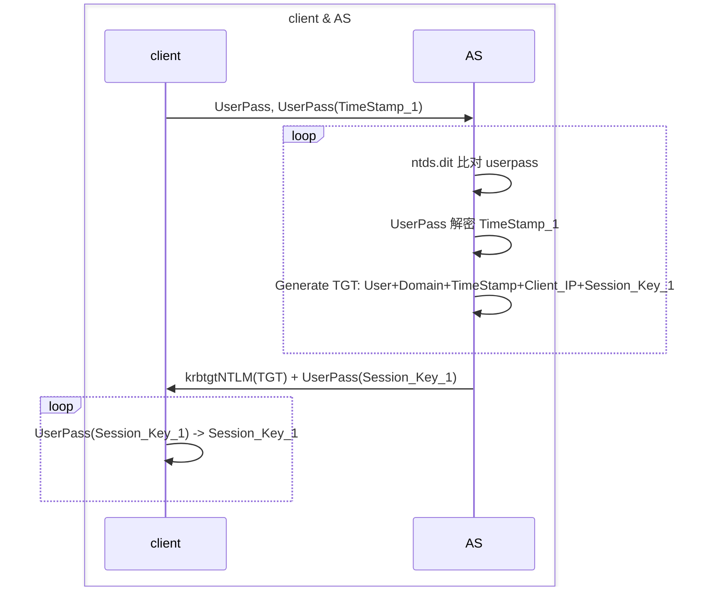
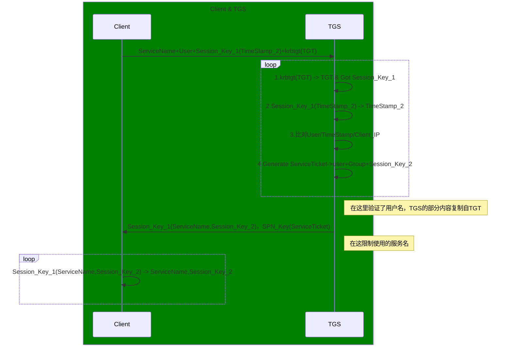
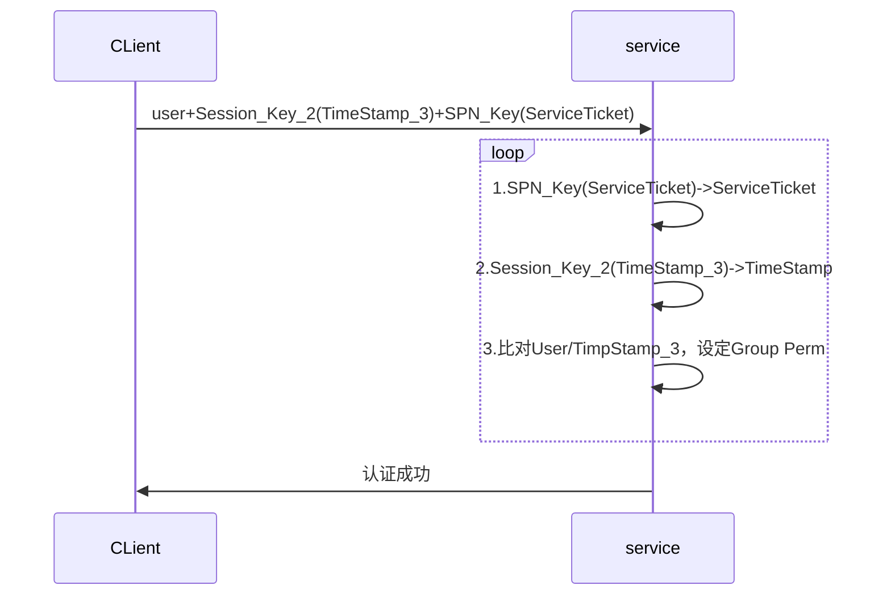

```mermaid
sequenceDiagram
box client & AS
participant client
participant AS
end
	client->>AS:UserPass, UserPass(TimeStamp_1)
	loop
		AS->>AS:ntds.dit 比对 userpass
		AS->>AS:UserPass 解密 TimeStamp_1
		AS->>AS:Generate TGT: User+Domain+TimeStamp+Client_IP+Session_Key_1
	end
	AS ->>client:krbtgtNTLM(TGT) + UserPass(Session_Key_1)
	loop
		client->>client:UserPass(Session_Key_1) -> Session_Key_1
	end
```

```mermaid
sequenceDiagram
box green Client & TGS
participant Client
participant TGS
end
	Client ->>TGS:ServiceName+User+Session_Key_1(TimeStamp_2)+krbtgt(TGT)
	loop
		TGS->>TGS:1.krbtgt(TGT) -> TGT & Got Session_Key_1
		TGS->>TGS:2.Session_Key_1(TimeStamp_2) -> TimeStamp_2
		TGS->>TGS:3.比对User/TimeStamp/Client_IP
		TGS->>TGS:4.Generate ServiceTicket->user+Group+Session_Key_2
	end
	note right of TGS:在这里验证了用户名，TGS的部分内容复制自TGT
	TGS->>Client:Session_Key_1(ServiceName,Session_Key_2)，SPN_Key(ServiceTicket)
	note right of TGS:在这限制使用的服务名
	loop
		Client->>Client:Session_Key_1(ServiceName,Session_Key_2) -> ServiceName,Session_Key_2
	end
```

```mermaid
sequenceDiagram
	CLient->>service:user+Session_Key_2(TimeStamp_3)+SPN_Key(ServiceTicket)
	loop
		service->>service:1.SPN_Key(ServiceTicket)->ServiceTicket
		service->>service:2.Session_Key_2(TimeStamp_3)->TimeStamp
		service->>service:3.比对User/TimpStamp_3，设定Group Perm
	end
	service->>CLient:认证成功
```

